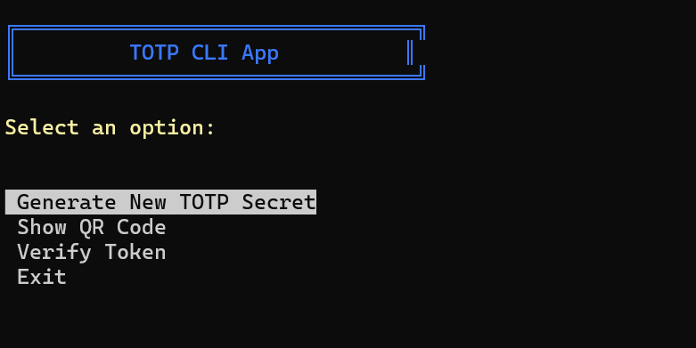

# Bun TOTP CLI Application 🔐

A secure and user-friendly Time-based One-Time Password (TOTP) command-line application built with Bun. Generate TOTP secrets, display QR codes for easy import into authenticator apps, and verify tokens - all from your terminal!


*Note: Add screenshot.png to see the application interface*

## 🚀 Features

- **Secret Generation**: Create secure TOTP secrets with industry-standard algorithms
- **QR Code Display**: Generate QR codes directly in your terminal for easy import into authenticator apps
- **Token Verification**: Verify TOTP tokens in real-time
- **Interactive UI**: User-friendly terminal interface with colorful menus
- **Persistent Storage**: Safely store TOTP secrets for future use

## 📋 Prerequisites

- [Bun](https://bun.sh) installed on your system
- Terminal that supports Unicode characters

## 🛠️ Installation

1. Clone the repository:
```bash
git clone https://github.com/ohidurbappy/nodejs-totp-app
cd bun-totp-cli
```

2. Install dependencies:
```bash
bun install
```

## 💻 Usage

1. Start the application:
```bash
bun start
```

2. Use the interactive menu to:
   - Generate a new TOTP secret
   - Display the QR code for importing into authenticator apps
   - Verify TOTP tokens
   - Exit the application

## 🔑 Key Commands

- Use arrow keys to navigate the menu
- Press Enter to select an option
- Press Ctrl+C to exit at any time

## 🛡️ Security

- Secrets are stored locally in a text file
- Uses the `otplib` library for secure TOTP implementation
- Follows TOTP standards (RFC 6238)

## 🧰 Technologies Used

- [Bun](https://bun.sh) - JavaScript runtime and toolkit
- [otplib](https://www.npmjs.com/package/otplib) - TOTP implementation
- [qrcode](https://www.npmjs.com/package/qrcode) - QR code generation
- [terminal-kit](https://www.npmjs.com/package/terminal-kit) - Terminal UI

## 📚 More Information

This CLI tool implements Time-based One-Time Passwords (TOTP) according to RFC 6238. It's compatible with popular authenticator apps like Google Authenticator, Authy, and Microsoft Authenticator.

### What is TOTP?

TOTP (Time-based One-Time Password) is a computer algorithm that generates a one-time password that uses the current time as a source of uniqueness. It's widely used in two-factor authentication (2FA) systems.

### Use Cases

- Development and testing of 2FA implementations
- Personal password management
- Security testing and demonstrations
- Learning about TOTP systems

## 📄 License

MIT License - feel free to use this project for learning, modification, and distribution.

## 🤝 Contributing

Contributions are welcome! Please feel free to submit a Pull Request.
